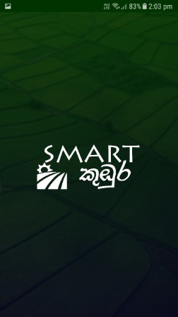
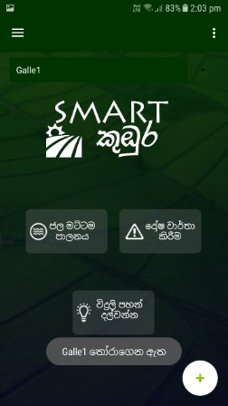

<h1>Smartකුඹුර</h1>

Android App to do Water Management Task in a paddy field

<ul>
	<li>
Farmers must install the app and register with us.

		
		
	</li>
	<li>
Farmer has the ability to add new paddy fields and select a particular paddy field for the moment.

		
		
	</li>
	<li>
It will be automatically saved to the local storage until he changes it.
</li>
	<li>
So, now he can check the water level via the app and set the required water level as he wish and start filling water, by just hitting a button.

		
		
	</li>
	<li>
Then, app will deliver a notification when the water is filled upto the level, and automatically sends a signal to stop water passing activity (to the ESP module via database)

		
		
	</li>
	
</ul>