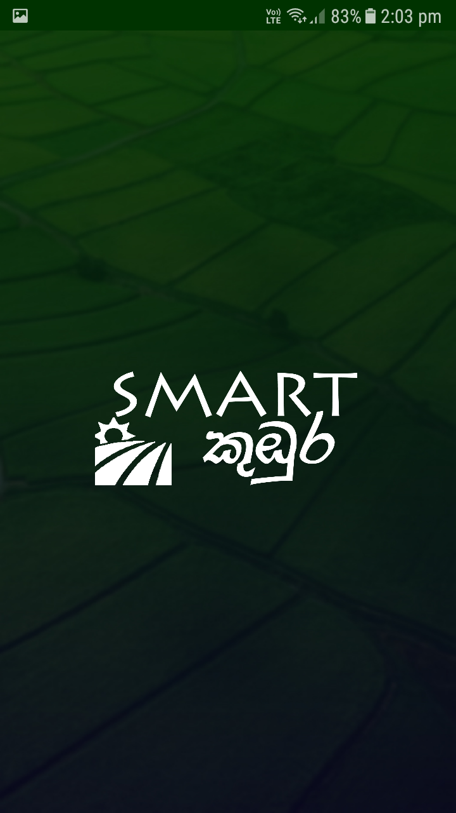
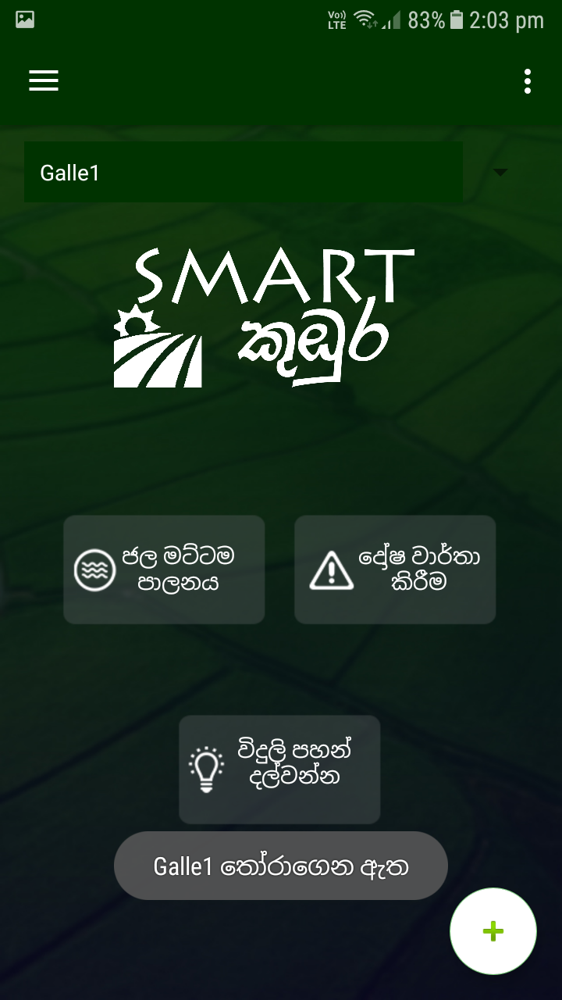
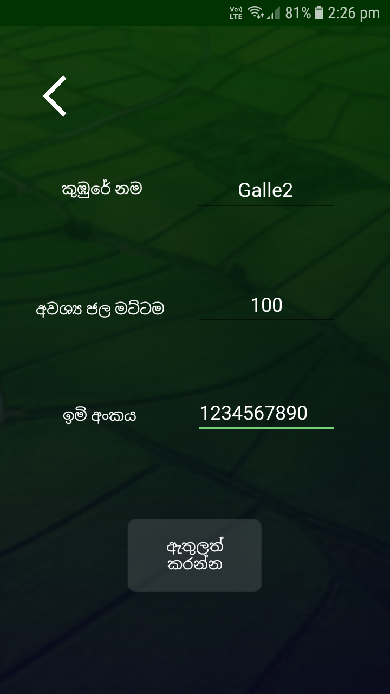
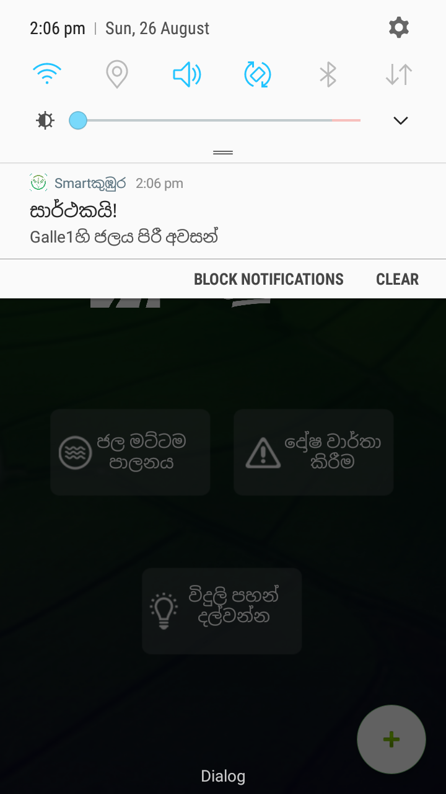

<h1>Smartකුඹුර</h1>

Android App to do Water Management Task in a paddy field

<ul>
	<li>Farmers must install the app and register with us
		
		
	</li>
	
	<li>Farmer has the ability to add new paddy fields and select a particular paddy field for the moment.
		
		
	</li>
	<li>It will be automatically saved to the local storage until he changes it.</li>
	<li>So, now he can check the water level via the app and set the required water level as he wish and start filling water, by just hitting a button.
		
		
	</li>
	<li>Then, app will deliver a notification when the water is filled upto the level, and automatically sends a signal to stop water passing activity (to the ESP module via database)
		
		
	</li>
	
</ul>